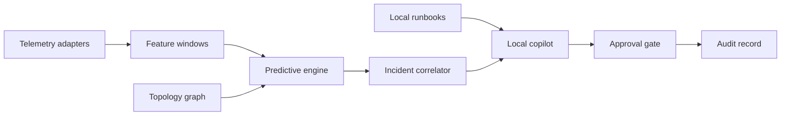

# MPLS Sentinel

An offline-first predictive operations copilot for secure MPLS networks.

MPLS Sentinel combines live topology, telemetry simulation, explainable failure forecasting, incident correlation, local operations reasoning, and approval-gated remediation in one Next.js application. It is designed for isolated environments where cloud inference, external telemetry, and automatic configuration changes are not acceptable.

> Built around Problem Statement 13 of the ISRO Bharatiya Antariksh Hackathon 2026: **Air-Gapped Predictive Copilot for Secure MPLS Operations**.

## What is working

- Interactive MPLS topology with core, provider-edge, and customer-edge nodes
- Live deterministic telemetry simulation for latency, packet loss, utilization, route flaps, and queue growth
- Inspectable predictive risk engine with signal-contribution scores
- Incident command view with correlated evidence and affected dependencies
- Local copilot endpoint with evidence-bound operational responses
- Approval-gated remediation workflow that never executes a real network change
- Immutable-style local audit feed for system and operator actions
- Incident report export as structured JSON
- Responsive interface with reduced-motion and keyboard support
- Zero external UI assets, fonts, analytics, or runtime APIs

## Screens

| Area | Capability |
| --- | --- |
| Overview | Service availability, backbone latency, peak utilization, predictive risk, topology, incidents, and copilot |
| Network topology | Interactive transport graph and node-level health inspection |
| Incident command | Evidence, forecast lead time, affected services, response recommendation, and approval |
| Predictive intelligence | Failure-probability trend, interpretable contributors, and pipeline integrity |
| Operations copilot | Local reasoning with traceable evidence references |
| Audit log | Operator decisions and system-generated records |
| Settings | Isolation, local reasoning, approval, and telemetry controls |

## Architecture



The current repository delivers a self-contained demonstration adapter. Production adapters can replace the simulator without changing the dashboard contracts.

See [Architecture](docs/ARCHITECTURE.md) and [Security model](docs/SECURITY.md) for the complete design.

## Tech stack

- Next.js 16 App Router
- React 19
- TypeScript
- Next.js Route Handlers
- Native SVG topology and charts
- Node.js test runner
- CSS without runtime frameworks or remote assets

## Run locally

Requirements:

- Node.js 20.9 or newer
- npm 10 or newer

```bash
npm install
npm run dev
```

Open `http://localhost:3000`.

## Validate

```bash
npm run validate
```

The validation pipeline runs:

1. Predictive-engine tests
2. Type checking
3. ESLint
4. Production build

Core tests can run without installing UI dependencies:

```bash
npm test
```

## Air-gapped deployment

The application requires no external runtime endpoint. For a physically isolated environment:

1. Build and scan the standalone artifact in an approved staging environment.
2. Generate a software bill of materials and sign the release bundle.
3. Transfer the bundle through the organisation's controlled media process.
4. Verify signatures and hashes inside the isolated network.
5. Bind only to approved local interfaces.
6. Connect local telemetry, runbook, and inference adapters.

The optional `LOCAL_MODEL_ENDPOINT` must point to a loopback or approved private address. The deterministic adapter remains available when no local language model is configured.

## Repository structure

```text
app/
  api/copilot/       Local reasoning contract
  globals.css        Complete interface system
  layout.tsx         Application metadata and shell
  page.tsx           Operations console entry
components/
  operations-console.tsx
  network-topology.tsx
  copilot-panel.tsx
  sparkline.tsx
lib/
  data.ts            Demonstration topology and incident data
  predictive-engine.js
  types.ts
tests/
  predictive-engine.test.mjs
docs/
  ARCHITECTURE.md
  SECURITY.md
```

## Production roadmap

- SNMPv3, syslog, gNMI, and NetFlow adapters
- Containerlab and FRRouting network simulation
- Time-series persistence with an approved local database
- Signed offline runbook ingestion and vector index
- Local model adapter with constrained tool calls
- Topology-aware reroute simulation
- Role-based access and two-person change approval
- Signed audit chain and tamper-evident export
- Model monitoring, calibration, and replay evaluation

## Safety boundary

This repository is an operations decision-support system. It does not connect to routers or execute configuration changes. Production control-plane integration must add authenticated device adapters, policy validation, dry-run simulation, explicit operator approval, rollback, and independent security review.
