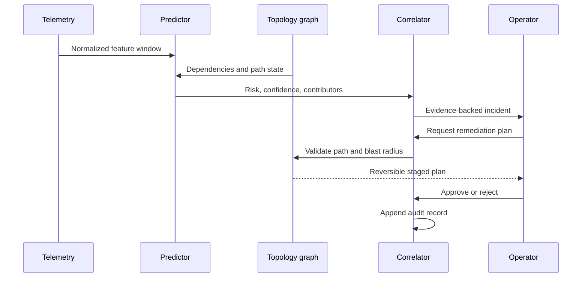

# System architecture

## Objective

MPLS Sentinel forecasts service-impacting MPLS events before threshold-based monitoring would normally raise an alarm. It correlates network telemetry with topology, explains the evidence, and prepares a reversible response for operator approval.

The system is intentionally useful without a language model. Forecasting, graph validation, incident correlation, and approval remain deterministic. A local model improves natural-language interaction but cannot bypass policy controls.

## Logical components

### 1. Telemetry adapters

Production adapters receive data from approved local sources:

- SNMPv3 interface and device counters
- Syslog and event streams
- gNMI subscriptions
- NetFlow or IPFIX flow summaries
- MPLS LSP, pseudowire, and tunnel state
- Environmental sensors

Every sample is timestamped, normalized, assigned a source identity, and checked for staleness.

### 2. Feature windows

Raw samples become rolling features:

- Latency mean, slope, and deviation from baseline
- Packet-loss rate and rate of change
- Link utilization and egress queue growth
- Route-flap frequency
- Tunnel state transitions
- Device CPU and thermal drift
- Missing-data and sensor-integrity indicators

### 3. Predictive engine

The demonstration uses an inspectable weighted model implemented in `lib/predictive-engine.js`. This makes the current behaviour deterministic, testable, and explainable.

A production system can introduce calibrated statistical and sequence models behind the same response contract:

```ts
interface RiskAssessment {
  score: number;
  level: "nominal" | "elevated" | "high" | "critical";
  confidence: number;
  contributors: Array<{ label: string; weight: number }>;
  leadTimeMinutes: number;
}
```

### 4. Topology validation

The dependency graph prevents telemetry-only recommendations. Before a reroute is proposed, the engine must verify:

- Reachability after the planned change
- Backup-path capacity
- Shared-risk link groups
- Service-class constraints
- Maintenance locks
- Blast radius
- Rollback path

### 5. Incident correlator

The correlator groups temporally and topologically related signals into one incident. It preserves the raw evidence used to establish:

- probable root cause
- confidence
- affected nodes and services
- estimated threshold-crossing time
- recommended next action

### 6. Local operations copilot

`POST /api/copilot` exposes the reasoning contract. The current adapter provides deterministic, evidence-linked answers and operates with zero external dependency.

A local model adapter can later retrieve from:

- signed operations runbooks
- approved configuration standards
- historical incident reports
- current telemetry windows
- topology snapshots

Every answer must contain evidence references. The copilot is not authorised to call network devices.

### 7. Approval gate

Recommendations enter a human-in-the-loop gate. An approval record contains:

- incident identity
- exact proposed steps
- precondition checks
- expected impact
- rollback plan
- operator identity
- timestamp and result

The current demonstration records the decision but never modifies a network.

### 8. Audit trail

System events, predictions, evidence access, exports, and approvals are represented in the audit interface. Production deployment should replace the in-memory feed with an append-only, hash-chained local store.

## Runtime data flow



## State in the current MVP

The MVP uses in-memory client state so it can demonstrate the complete interaction without infrastructure. Refreshing the page returns it to the seeded scenario. This is deliberate and clearly separates working decision logic from future persistence adapters.
