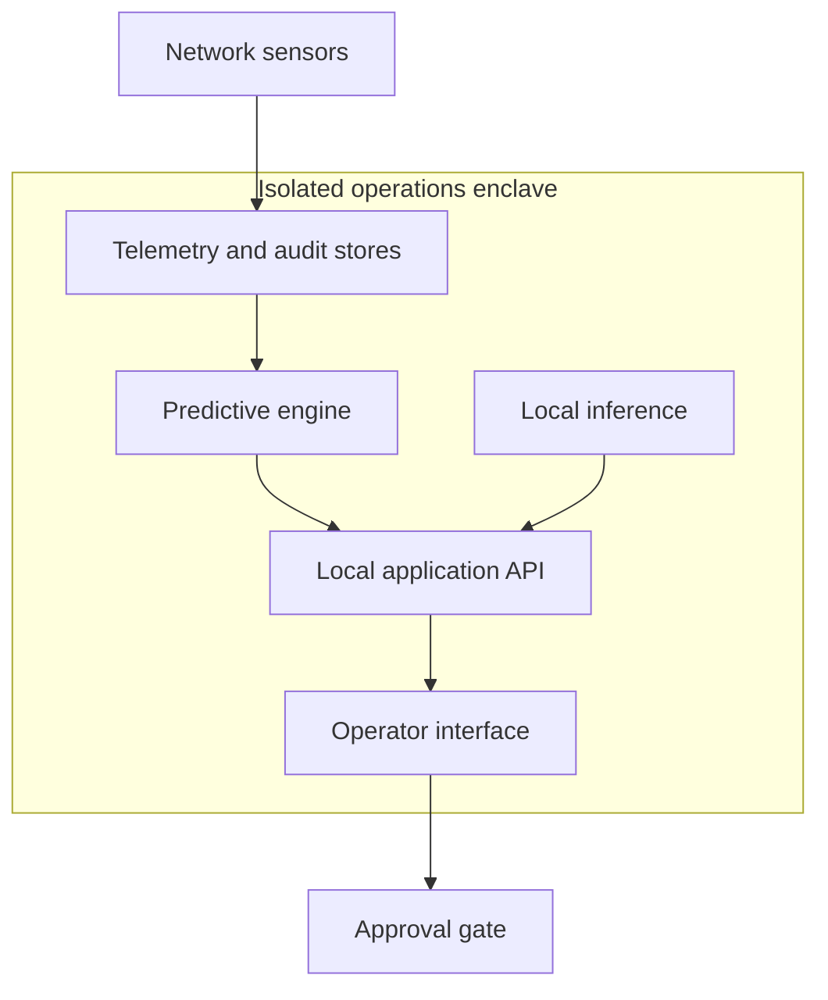

# Security model

## Security objectives

- Operate without public network access.
- Keep predictive and copilot evidence local.
- Prevent autonomous network changes.
- Make every recommendation traceable.
- Fail safely when telemetry or reasoning components are unavailable.
- Preserve a reviewable history of operator decisions.

## Trust boundaries

No component inside the enclave requires a public endpoint. Network devices are outside the application trust boundary until a separately reviewed device adapter is introduced.

## Current controls

- No remote scripts, fonts, images, stylesheets, analytics, or inference APIs
- Disabled framework identification header
- Input length and JSON validation on the copilot route
- Evidence references attached to local reasoning
- Deterministic fallback when a local model is absent
- Operator approval required for proposed remediation
- Demonstration adapter cannot connect to a router
- Export contains structured incident data, not credentials
- Secret and environment files are excluded from version control

## Required production controls

### Identity and access

- Integrate approved local identity
- Enforce least-privilege roles
- Require stronger authentication for change approval
- Use two-person approval for high-impact changes
- Separate administrators, operators, auditors, and model maintainers

### Data integrity

- Authenticate all telemetry sources
- Sign topology and runbook packages
- Hash-chain audit records
- Verify model files before load
- Reject stale or replayed telemetry
- Record clock health and time-source identity

### Device integration

- Use dedicated read-only credentials for observation
- Isolate configuration credentials from the web process
- Validate every command against an allowlist
- Run topology and capacity checks before staging
- Provide dry-run, rollback, and timeout behaviour
- Keep autonomous execution disabled by default

### Local inference

- Bind inference services only to loopback or an approved private interface
- Enforce structured output
- Treat retrieved documents and logs as untrusted data
- Prevent retrieved content from changing policy
- Do not grant shell, device, or filesystem tools to the language model
- Log prompt context hashes and evidence identities

### Release process

- Pin and scan dependencies
- Produce a software bill of materials
- Sign the standalone bundle and container image
- Transfer through approved media controls
- Verify hashes after transfer
- Preserve a reproducible build record

## Reporting a vulnerability

Do not publish operational details, credentials, or exploit material in a public issue. Contact the repository owner privately with:

- affected component
- reproducible impact
- safe proof of concept
- suggested remediation

No real network addresses, configurations, or credentials belong in this repository.
